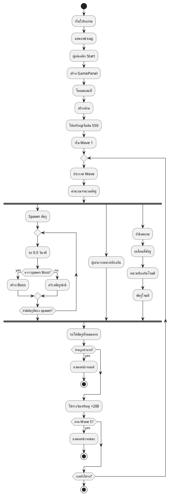
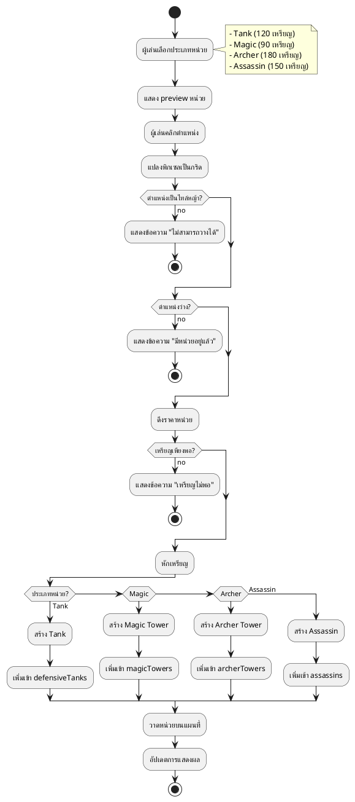
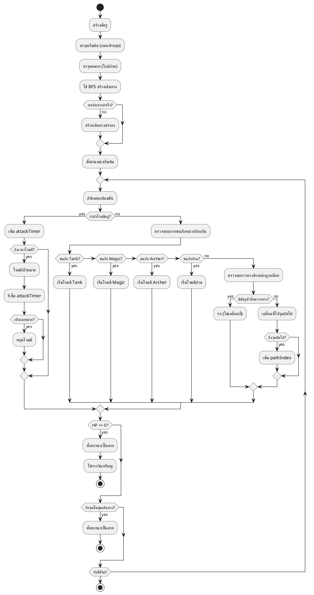
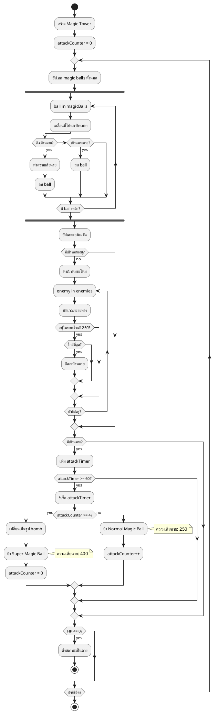
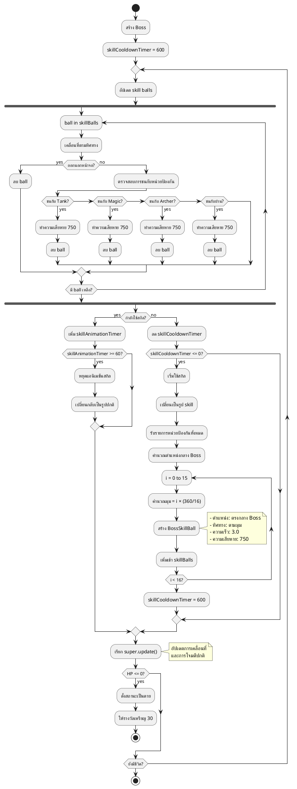
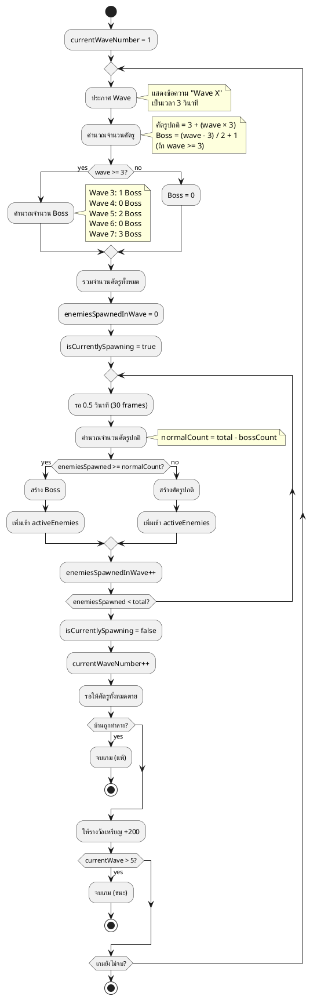
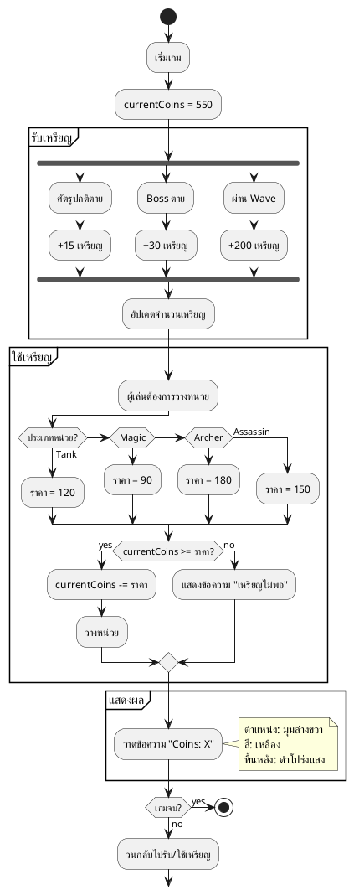
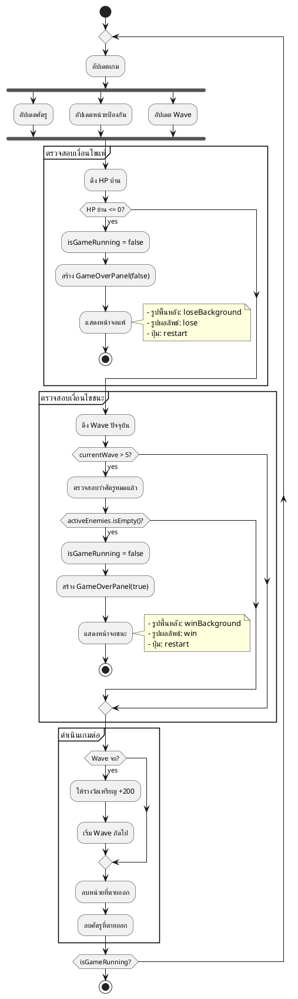

# UML Activity Diagrams - Tower Defense Game

## 1. Main Game Flow Activity Diagram

## 2. Place Defensive Unit Activity Diagram

## 3. Enemy Movement and Pathfinding Activity Diagram

## 4. Magic Tower Attack Activity Diagram

## 5. Boss Special Skill Activity Diagram

## 6. Wave Management Activity Diagram

## 7. Coin Management Activity Diagram

## 8. Game Over Check Activity Diagram

## คำอธิบาย Activity Diagrams

### 1. Main Game Flow
แสดงขั้นตอนหลักของเกมตั้งแต่เริ่มจนจบ รวมถึง loop หลักของการเล่น

### 2. Place Defensive Unit
แสดงขั้นตอนการวางหน่วยป้องกัน รวมถึงการตรวจสอบเงื่อนไขต่างๆ

### 3. Enemy Movement and Pathfinding
แสดงการเคลื่อนที่ของศัตรู การหาเส้นทาง และการโจมตี

### 4. Magic Tower Attack
แสดงระบบการโจมตีของ Magic Tower รวมถึงการนับจำนวนครั้งเพื่อใช้ spell

### 5. Boss Special Skill
แสดงการทำงานของสกิลพิเศษของ Boss ที่ยิงลูกไฟรอบตัว

### 6. Wave Management
แสดงการจัดการ Wave รวมถึงการคำนวณจำนวนศัตรูและ Boss

### 7. Coin Management
แสดงระบบการรับและใช้เหรียญในเกม

### 8. Game Over Check
แสดงการตรวจสอบเงื่อนไขชนะ/แพ้ในทุก frame
