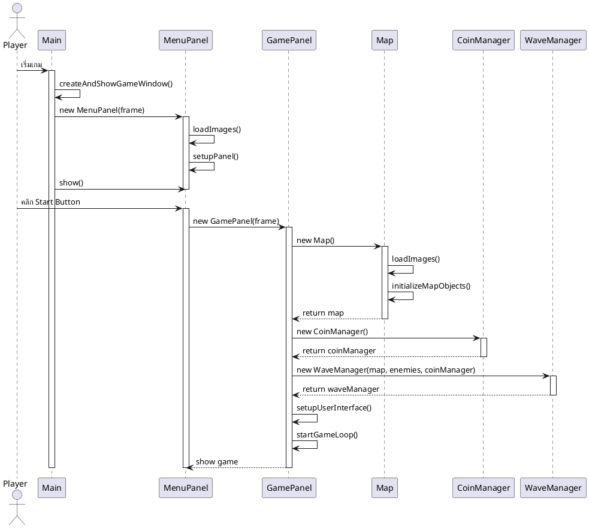
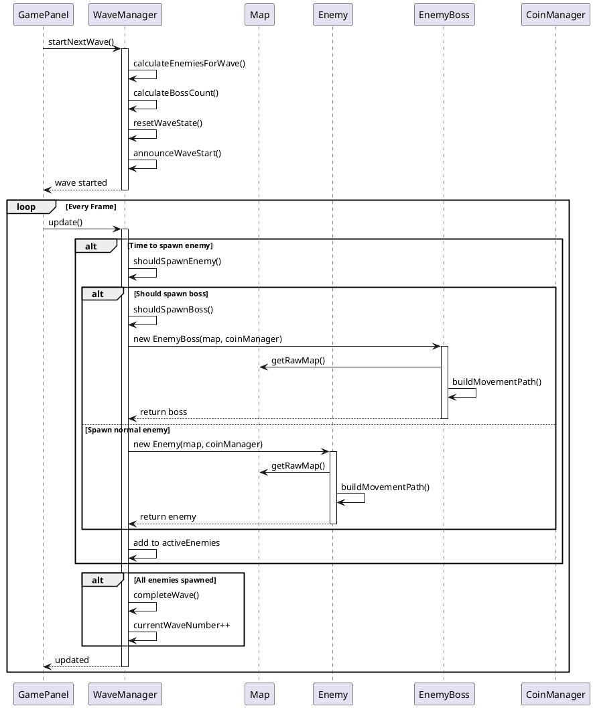
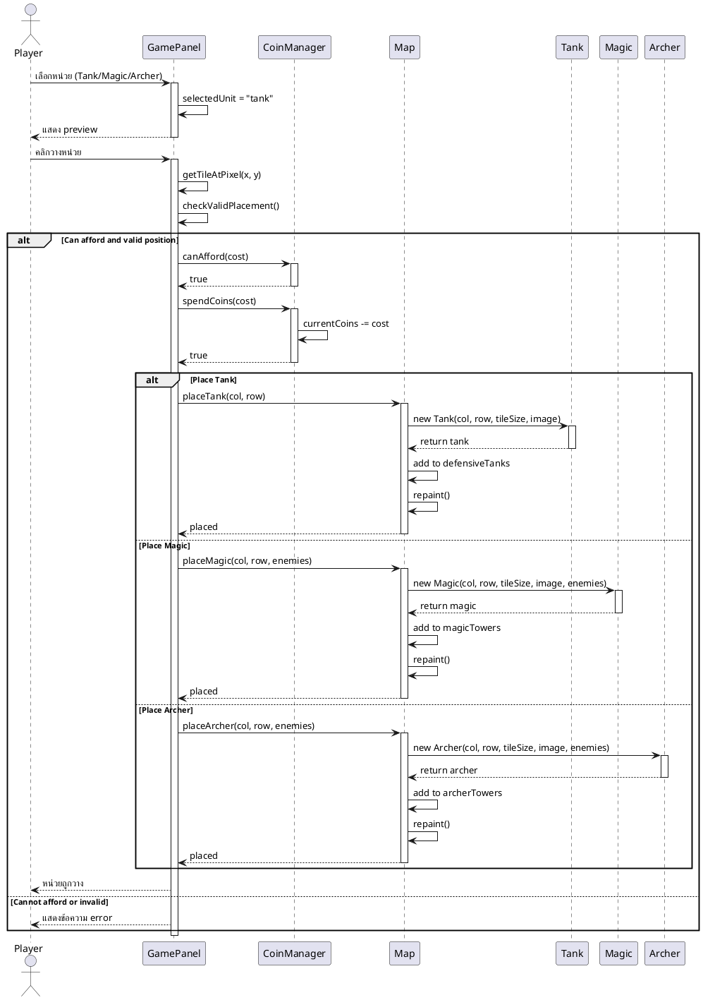
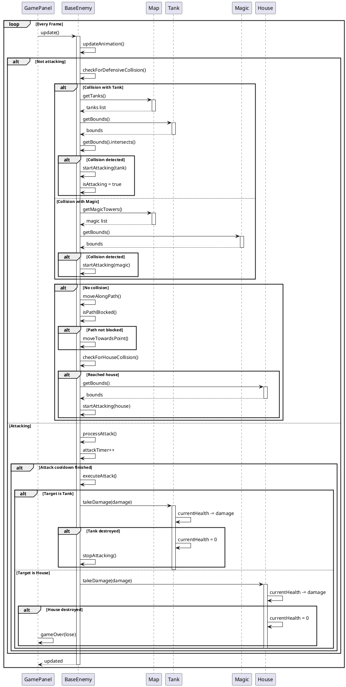
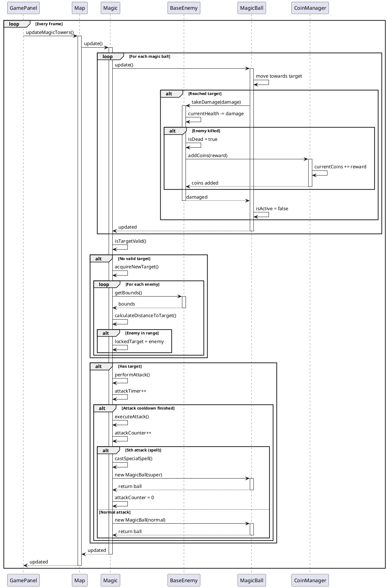
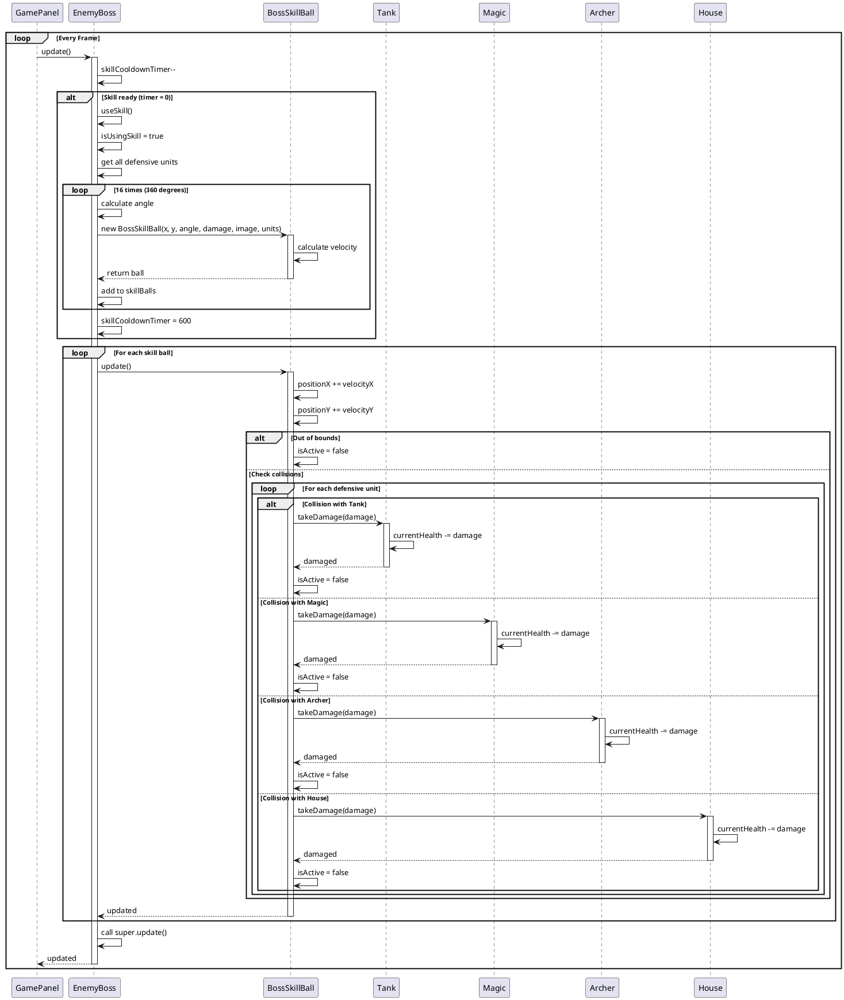
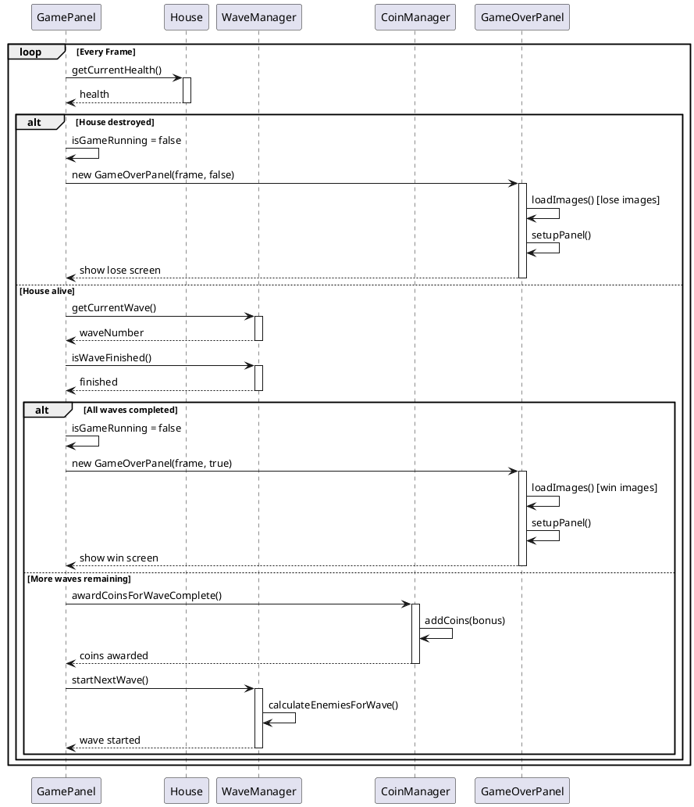

# UML Sequence Diagrams - Tower Defense Game

## 1. Game Startup Sequence

## 2. Wave Spawning Sequence

## 3. Player Places Defensive Unit Sequence

## 4. Enemy Movement and Attack Sequence

## 5. Magic Tower Attack Sequence

## 6. Boss Special Skill Sequence

## 7. Game Over Sequence

## คำอธิบาย Sequence Diagrams

### 1. Game Startup
แสดงขั้นตอนการเริ่มเกมตั้งแต่ Main → MenuPanel → GamePanel และการสร้าง components ต่างๆ

### 2. Wave Spawning
แสดงกระบวนการ spawn ศัตรูในแต่ละ wave รวมถึงการตัดสินใจว่าจะ spawn Boss หรือไม่

### 3. Place Defensive Unit
แสดงขั้นตอนการวางหน่วยป้องกัน ตั้งแต่การเลือก ตรวจสอบเงิน ไปจนถึงการวางจริง

### 4. Enemy Movement and Attack
แสดงการเคลื่อนที่ของศัตรู การตรวจสอบการชน และการโจมตีหน่วยป้องกัน

### 5. Magic Tower Attack
แสดงระบบการโจมตีของ Magic tower รวมถึงการยิง MagicBall และการทำ special spell

### 6. Boss Special Skill
แสดงการใช้สกิลพิเศษของ Boss ที่ยิง BossSkillBall รอบตัว 360 องศา

### 7. Game Over
แสดงเงื่อนไขการจบเกม ทั้งแพ้ (บ้านถูกทำลาย) และชนะ (ผ่านทุก wave)
