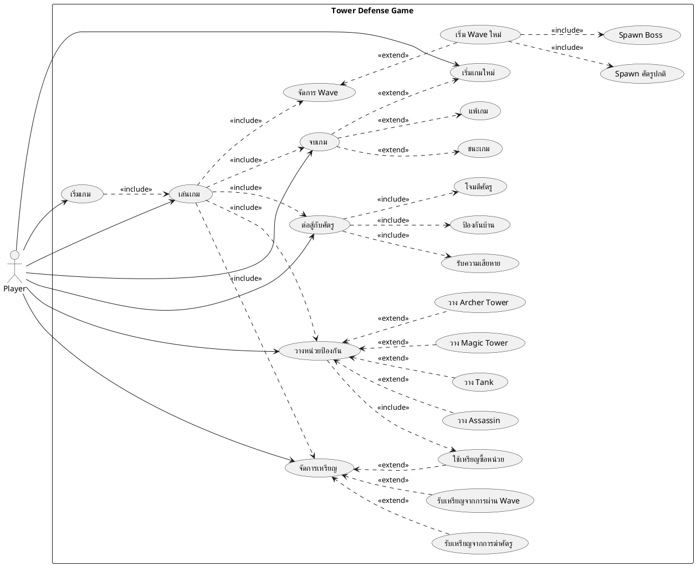

# UML Use Case Diagram - Tower Defense Game

## Use Case Diagram

## Use Case Descriptions

### UC1: เริ่มเกม
**Actor**: Player  
**Description**: ผู้เล่นเริ่มเกมจากหน้าเมนู  
**Preconditions**: โปรแกรมทำงานอยู่  
**Postconditions**: เกมเริ่มต้น Wave 1  
**Main Flow**:
1. ผู้เล่นเห็นหน้าเมนู
2. ผู้เล่นคลิกปุ่ม Start
3. ระบบโหลดแผนที่และสร้างบ้าน
4. ระบบให้เหรียญเริ่มต้น 550
5. ระบบเริ่ม Wave 1

---

### UC2: เล่นเกม
**Actor**: Player  
**Description**: ผู้เล่นเล่นเกมโดยวางหน่วยป้องกันและต่อสู้กับศัตรู  
**Preconditions**: เกมเริ่มแล้ว  
**Postconditions**: เกมดำเนินต่อไปหรือจบเกม  
**Main Flow**:
1. ระบบแสดงแผนที่และ UI
2. ผู้เล่นวางหน่วยป้องกัน
3. ศัตรู spawn และเคลื่อนที่
4. หน่วยป้องกันโจมตีศัตรู
5. ศัตรูโจมตีหน่วยป้องกันและบ้าน
6. ระบบตรวจสอบเงื่อนไขชนะ/แพ้

---

### UC5: วางหน่วยป้องกัน
**Actor**: Player  
**Description**: ผู้เล่นวางหน่วยป้องกันบนแผนที่  
**Preconditions**: 
- มีเหรียญเพียงพอ
- ตำแหน่งที่เลือกว่าง
- ตำแหน่งเป็นไทล์หญ้า  
**Postconditions**: หน่วยถูกวางและเหรียญถูกหัก  
**Main Flow**:
1. ผู้เล่นเลือกประเภทหน่วย (Tank/Magic/Archer/Assassin)
2. ระบบแสดง preview หน่วย
3. ผู้เล่นคลิกตำแหน่งที่ต้องการวาง
4. ระบบตรวจสอบเงื่อนไข
5. ระบบหักเหรียญ
6. ระบบวางหน่วยบนแผนที่  
**Alternative Flow**:
- 4a. ถ้าเหรียญไม่พอ: แสดงข้อความแจ้งเตือน
- 4b. ถ้าตำแหน่งไม่ว่าง: ไม่สามารถวางได้
- 4c. ถ้าไม่ใช่ไทล์หญ้า: ไม่สามารถวางได้

---

### UC6: วาง Tank
**Actor**: Player  
**Description**: ผู้เล่นวาง Tank เพื่อป้องกัน  
**Preconditions**: มีเหรียญ 120 ขึ้นไป  
**Postconditions**: Tank ถูกวางและพร้อมรับความเสียหาย  
**Properties**:
- ราคา: 120 เหรียญ
- HP: 16,000
- ขนาด: 2x2 ไทล์
- ความสามารถ: รับความเสียหายแทนหน่วยอื่น

---

### UC7: วาง Magic Tower
**Actor**: Player  
**Description**: ผู้เล่นวาง Magic Tower เพื่อโจมตีศัตรู  
**Preconditions**: มีเหรียญ 90 ขึ้นไป  
**Postconditions**: Magic Tower ถูกวางและเริ่มโจมตีศัตรู  
**Properties**:
- ราคา: 90 เหรียญ
- HP: 3,500
- ขนาด: 2x2 ไทล์
- ความสามารถ: ยิง magic ball, ทุก 5 ครั้งใช้ spell พิเศษ
- ระยะโจมตี: 250 พิกเซล
- ความเสียหาย: 250 (ปกติ), 400 (spell)

---

### UC8: วาง Archer Tower
**Actor**: Player  
**Description**: ผู้เล่นวาง Archer Tower เพื่อยิงศัตรู  
**Preconditions**: มีเหรียญ 180 ขึ้นไป  
**Postconditions**: Archer Tower ถูกวางและเริ่มยิงศัตรู  
**Properties**:
- ราคา: 180 เหรียญ
- HP: 3,500
- ขนาด: 2x2 ไทล์
- ความสามารถ: ยิงลูกศร
- ระยะโจมตี: 400 พิกเซล
- ความเสียหาย: 100

---

### UC9: วาง Assassin
**Actor**: Player  
**Description**: ผู้เล่นวาง Assassin เพื่อโจมตีศัตรูระยะประชิด  
**Preconditions**: มีเหรียญ 150 ขึ้นไป  
**Postconditions**: Assassin ถูกวางและรอโจมตีศัตรู  
**Properties**:
- ราคา: 150 เหรียญ
- ขนาด: 2x2 ไทล์
- ความสามารถ: โจมตีศัตรูที่เดินผ่าน
- ระยะโจมตี: 80 พิกเซล
- ความเสียหาย: 600
- หมายเหตุ: ไม่สามารถถูกโจมตีได้

---

### UC10: จัดการเหรียญ
**Actor**: Player  
**Description**: ระบบจัดการเหรียญของผู้เล่น  
**Preconditions**: เกมเริ่มแล้ว  
**Postconditions**: เหรียญถูกอัปเดต  
**Main Flow**:
1. ระบบให้เหรียญเริ่มต้น 550
2. ผู้เล่นรับเหรียญจากการฆ่าศัตรู (+15)
3. ผู้เล่นรับเหรียญจากการฆ่า Boss (+30)
4. ผู้เล่นรับเหรียญจากการผ่าน Wave (+200)
5. ผู้เล่นใช้เหรียญซื้อหน่วย
6. ระบบแสดงจำนวนเหรียญปัจจุบัน

---

### UC14: จัดการ Wave
**Actor**: System  
**Description**: ระบบจัดการการ spawn ศัตรูในแต่ละ wave  
**Preconditions**: เกมเริ่มแล้ว  
**Postconditions**: Wave เสร็จสิ้นหรือเริ่ม wave ใหม่  
**Main Flow**:
1. ระบบประกาศ Wave ใหม่
2. ระบบคำนวณจำนวนศัตรู
3. ระบบ spawn ศัตรูทีละตัว (ทุก 0.5 วินาที)
4. Wave 3+: spawn Boss ตัวสุดท้าย
5. รอให้ศัตรูทั้งหมดตาย
6. ให้รางวัลเหรียญ
7. เริ่ม wave ถัดไป  
**Wave Formula**:
- ศัตรูปกติ: 3 + (wave × 3)
- Boss: (wave - 3) / 2 + 1 (ถ้า wave >= 3)
- Wave 3: 1 Boss
- Wave 5: 2 Boss
- Wave 7: 3 Boss

---

### UC17: Spawn Boss
**Actor**: System  
**Description**: ระบบ spawn Boss ในบาง wave  
**Preconditions**: Wave >= 3  
**Postconditions**: Boss ถูก spawn  
**Properties**:
- HP: 17,000
- ความเสียหาย: 2,000
- ความเร็ว: 0.3
- ขนาด: 128 พิกเซล
- สกิลพิเศษ: ยิงลูกไฟรอบตัว 16 ลูก ทุก 10 วินาที
- รางวัล: 30 เหรียญ

---

### UC18: ต่อสู้กับศัตรู
**Actor**: Player, System  
**Description**: การต่อสู้ระหว่างหน่วยป้องกันและศัตรู  
**Preconditions**: มีศัตรูและหน่วยป้องกันบนแผนที่  
**Postconditions**: ศัตรูหรือหน่วยป้องกันตาย  
**Main Flow**:
1. ศัตรูเคลื่อนที่ตามเส้นทาง
2. หน่วยป้องกันตรวจจับศัตรูในระยะ
3. หน่วยป้องกันโจมตีศัตรู
4. ศัตรูชนหน่วยป้องกัน
5. ศัตรูโจมตีหน่วยป้องกัน
6. ตรวจสอบ HP ของทั้งสองฝ่าย
7. ลบหน่วยที่ตายออกจากเกม

---

### UC19: ป้องกันบ้าน
**Actor**: System  
**Description**: หน่วยป้องกันป้องกันบ้านจากศัตรู  
**Preconditions**: มีหน่วยป้องกันบนแผนที่  
**Postconditions**: ศัตรูถูกหยุดหรือทำลาย  
**Main Flow**:
1. Tank ขวางทางศัตรู
2. Magic/Archer ยิงศัตรูจากระยะไกล
3. Assassin โจมตีศัตรูที่เดินผ่าน
4. ศัตรูถูกทำลายก่อนถึงบ้าน  
**Alternative Flow**:
- ศัตรูผ่านหน่วยป้องกันและโจมตีบ้าน

---

### UC22: ชนะเกม
**Actor**: Player  
**Description**: ผู้เล่นชนะเกมโดยผ่านทุก wave  
**Preconditions**: 
- ผ่าน Wave 5 แล้ว
- บ้านยังมี HP เหลืออยู่  
**Postconditions**: แสดงหน้าจอชนะ  
**Main Flow**:
1. ผู้เล่นผ่าน Wave 5
2. ศัตรูทั้งหมดตาย
3. ระบบตรวจสอบ currentWave > MAX_WAVES
4. ระบบหยุดเกม
5. แสดงหน้าจอชนะ
6. แสดงปุ่ม Restart

---

### UC23: แพ้เกม
**Actor**: Player  
**Description**: ผู้เล่นแพ้เกมเมื่อบ้านถูกทำลาย  
**Preconditions**: บ้าน HP = 0  
**Postconditions**: แสดงหน้าจอแพ้  
**Main Flow**:
1. ศัตรูโจมตีบ้าน
2. บ้าน HP ลดลงเป็น 0
3. ระบบตรวจสอบ house.isDestroyed()
4. ระบบหยุดเกม
5. แสดงหน้าจอแพ้
6. แสดงปุ่ม Restart

---

### UC4: เริ่มเกมใหม่
**Actor**: Player  
**Description**: ผู้เล่นเริ่มเกมใหม่หลังจบเกม  
**Preconditions**: เกมจบแล้ว (ชนะหรือแพ้)  
**Postconditions**: เกมรีเซ็ตและเริ่มใหม่  
**Main Flow**:
1. ผู้เล่นคลิกปุ่ม Restart
2. ระบบรีเซ็ตทุกอย่าง
3. ระบบสร้าง GamePanel ใหม่
4. เริ่มเกมจาก Wave 1

## Actor Descriptions

### Player (ผู้เล่น)
**Description**: ผู้เล่นเกม Tower Defense  
**Responsibilities**:
- เริ่มเกม
- วางหน่วยป้องกัน
- จัดการทรัพยากร (เหรียญ)
- ตัดสินใจกลยุทธ์การป้องกัน

### System (ระบบ)
**Description**: ระบบเกม Tower Defense  
**Responsibilities**:
- จัดการ Wave และ spawn ศัตรู
- คำนวณการต่อสู้
- ตรวจสอบเงื่อนไขชนะ/แพ้
- จัดการ AI ของศัตรูและหน่วยป้องกัน
